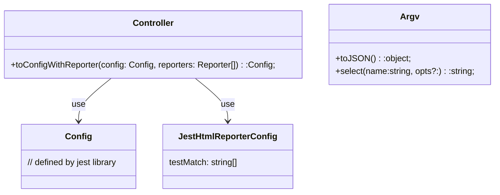

# ARCHITECTURE

```mermaid
classDiagram

class Config {
    // defined by jest library
}

class Controller {
    +toConfigWithReporter(config: Config, reporters: Reporter[]):Config;
}


class Argv {
    +toJSON():object;
    +select(name:string, opts?: ):string;
}

class JestHtmlReporterConfig {
    testMatch: string[]
}


Controller --> Config: use
Controller --> JestHtmlReporterConfig: use


```
